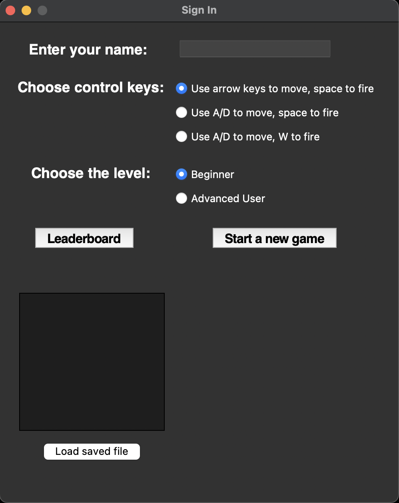
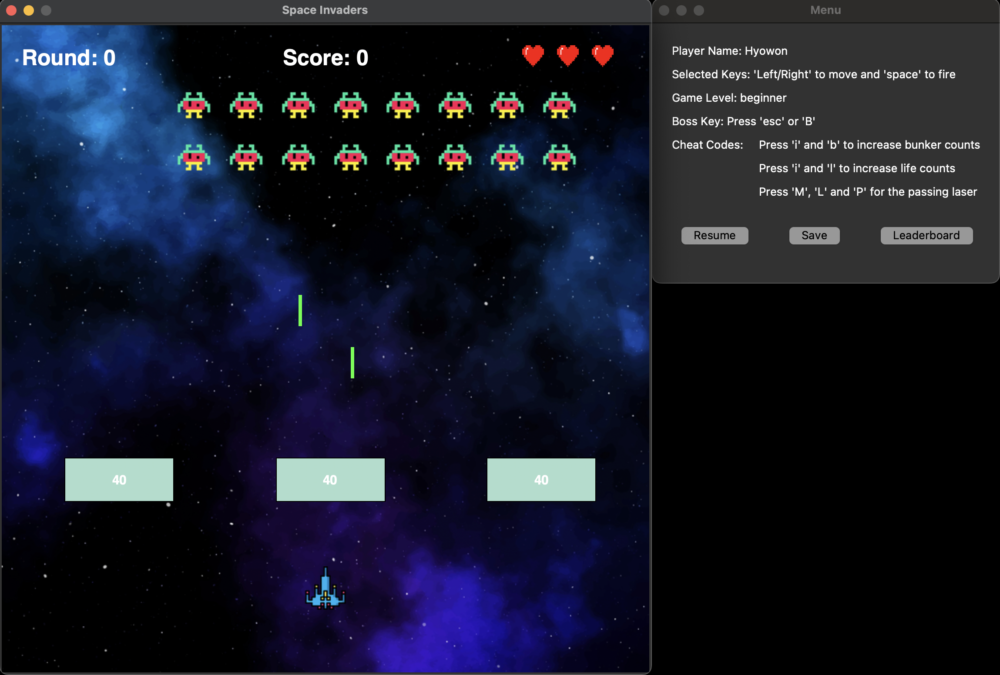

# 📦 Space Invaders

A simple and fun recreation of the classic **Space Invaders** arcade game built with **Python** and **Pygame**.

## 🚀 Features

- Classic arcade-style gameplay
- Smooth controls for moving the cannon and shooting
- Multiple alien invaders
- Lives counter and basic leaderboard
- Background graphics and custom sprites
- Customizable controls
- Scoring system
- Pause and unpause feature
- Cheat codes for enhanced gameplay
- Save and load functionality for game progress
- Boss key for quick exit
- Dynamic difficulty adjustment based on player performance

## 📸 Preview

Here are some screenshots of the game:

### Start Menu



### Gameplay Screen




## 🛠 Requirements

- Python 3.x
- Pygame

Install dependencies:

```bash
pip install pygame
```

## 🌹 How to Play

- **Move Left:** Press the **Left Arrow** key
- **Move Right:** Press the **Right Arrow** key
- **Shoot:** Press the **Spacebar**
- Destroy all aliens while avoiding their attacks!
- You have a limited number of lives.
- **Pause/Unpause:** Press **M** to pause or resume the game.
- **Boss Key:** Press **esc** or **B** to quickly hide the game.
- Use cheat codes to gain advantages (refer to game instructions).

## 📂 Project Structure

```
Space-Invaders/
├── game_solution.py       # Main game logic
├── leaderboard.txt        # Saves leaderboard scores
├── alien1.png              # Alien sprite
├── cannon.png              # Cannon (player) sprite
├── life.png                # Life icon
├── spaceBg.jpg             # Background image
├── fakeWorkingImage.png    # Placeholder image
├── README.md               # Project documentation
├── Screenshot_2025-04-27_at_11.18.58.png # Gameplay screenshot
├── Screenshot_2025-04-27_at_11.20.22.png # Start menu screenshot
```

## 🧐 How It Works

### Player-Controlled Movement

The player can move the cannon left and right along the bottom of the screen and shoot bullets upward at incoming aliens.

### Scoring System

Points are awarded for each alien destroyed. The score increases as the player defeats more enemies, and scores are saved in the leaderboard.

### Leaderboards

The game records high scores and displays them to encourage competitive play.

### Customisable Controls

There are 3 control options at the start to suit player preferences. However, offering more flexible, specific key mapping could further improve usability.

### Pause/Unpause Feature

Players can pause the game at any moment to take a break and then resume when ready.

### Cheat Codes

Special key combinations enable hidden cheat modes, like invincibility or rapid fire. The cheat code implementation is creative and enhances gameplay experience.

### Save/Load Functionality

Players can save their current progress and load it later to continue playing. However, note that currently projectiles are not saved accurately, which could be improved.

### Boss Key

A "Boss Key" feature instantly hides the game screen, replacing it with a fake work image.

### Object Movement and Collision Detection

Aliens, bullets, and the player cannon are all animated with collision detection to determine hits and impacts. Collision detection is functional but relatively simplistic and could be made more sophisticated.

### Dynamic Difficulty Adjustment

A player can choose the level between 'Beginner' and 'Advanced User'. As the player progresses, the speed and number of aliens increase, making the game progressively harder. The implementation of difficulty scaling is well-executed.

## 📈 Room for Improvements

- Provide more options for players to fully customise key mappings instead of just selecting presets.
- Improve the save/load functionality to correctly handle projectile data.
- Enhance collision detection and object movement to make gameplay more dynamic and realistic.
- Continue improving visuals while maintaining the simple and effective style.

## ✍️ Author

- Hyowon Ahn
- Class Assignment for Introduction to Programming 1 (Year 1, Semester 1)

## 📜 License

This project is for educational purposes.

